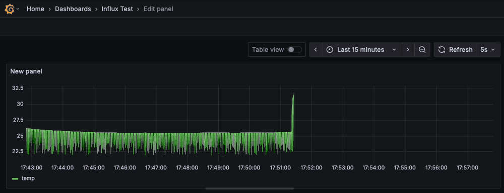

# FreeRTOS-Based Sensor Node with Arduino Uno & BME280



## 📌 Overview
This project demonstrates a real-time sensor node built using:

- **Arduino Uno**
- **BME280 Environmental Sensor (I2C)**
- **FreeRTOS (via PlatformIO)**
- **JSON-formatted UART output**

It utilizes FreeRTOS tasks for concurrency and includes basic error handling for I2C communication.

---

## 🔧 Hardware Requirements

- Arduino Uno (or compatible clone)
- BME280 I2C sensor module
- Breadboard + jumper wires
- USB cable

---

## 🧰 Software Requirements

- [PlatformIO CLI](https://platformio.org/install)
- Python 3 (for PlatformIO)
- macOS, Linux, or Windows

---

## 🚀 Getting Started

### 1. Clone the Project

```bash
git clone https://github.com/yourusername/nano-freertos-sensor-node.git
cd nano-freertos-sensor-node
```

### 2. Initialize PlatformIO

```bash
pio project init --board uno --project-option="framework=arduino"
```

### 3. Install Required Libraries

```bash
pio lib install "Adafruit BME280 Library"
pio lib install "FreeRTOS"
```

### 4. Upload to Board

Make sure your Arduino Uno is connected via USB:

```bash
pio run -t upload --upload-port /dev/cu.usbserial-XXXX
```

_Replace `XXXX` with the actual port. Use `pio device list` to find it._

### 5. Monitor Output

```bash
pio device monitor -b 115200 --port /dev/cu.usbserial-XXXX
```

You should see:

```json
{"T":24.15,"H":48.32,"P":1001.88}
{"T":24.12,"H":48.40,"P":1002.01}
```

---

## 🧠 Architecture

- **Task 1:** Reads data from BME280 sensor
- **Task 2:** Serializes and outputs data in JSON
- **Queue:** Shared message buffer between the two tasks

---

## 🐞 Common Issues

### Upload Fails (`stk500_recv()`):

- Try pressing RESET during upload
- Switch to `uno_old_bootloader` in `platformio.ini`

### No Sensor Found:

- Check SDA/SCL wiring (A4/A5 on Uno)
- Try I2C scanner sketch

### Output Shows `?`:

- AVR `printf` doesn't support floats. Use `Serial.print()` instead.

---

## 📁 Project Structure

```
nano-freertos-sensor-node/
├── include/              # Header files (optional)
├── lib/                  # Custom libraries (if needed)
├── src/
│   └── main.cpp          # Main application logic
├── platformio.ini        # PlatformIO build config
└── README.md             # Project overview
```

---

## 📈 Future Improvements

- Add command parsing via UART
- Add MQTT output via WiFi microcontroller
- Port to ESP32 or STM32

---

## 🤝 Credits

Created by **Reeve Fernandes** — inspired by real embedded debugging and hands-on hardware work.

---

## 📜 License

MIT License. See `LICENSE` file for details.

# FreeRTOS Sensor Node (Arduino Uno + BME280) with Live Grafana Telemetry

A real embedded mini‑pipeline that goes from **sensor → firmware → serial → MQTT → Node‑RED → InfluxDB → Grafana**.  
Firmware runs FreeRTOS on an Arduino Uno and emits JSON every ~1s. The Docker stack gives you a local, reproducible telemetry backend and a live chart.

> **Demo (drop your GIF here in the repo):**  
> ``

---

## 📌 Overview

- **Board:** Arduino Uno  
- **Sensor:** BME280 (I²C, addresses `0x76/0x77`)  
- **RTOS:** FreeRTOS (PlatformIO)  
- **Output:** JSON over UART @ 115200  
- **Telemetry stack:** Mosquitto (MQTT), Node‑RED, InfluxDB v2, Grafana (via Docker Compose)

The firmware uses two tasks:
- `sensorTask` reads the BME280 and pushes a struct into a FreeRTOS queue.  
- `serialTask` pops from the queue and prints one JSON object per line.

---

## 🔧 Hardware

- Arduino Uno (or compatible)
- BME280 I²C sensor module
- Breadboard + jumpers, USB cable

**Wiring (Uno):**
- VCC → 3.3V  
- GND → GND  
- SDA → A4  
- SCL → A5

> Some BME280 boards default to `0x76`, others `0x77`. The firmware tries both and fast‑blinks the LED if not found.

---

## 🧰 Software Prereqs

- [PlatformIO CLI](https://platformio.org/install)
- Python 3 (for PlatformIO + bridge)
- Docker Desktop (for the telemetry stack)
- macOS, Linux, or Windows

---

## 🚀 Quick Start (Firmware Only)

```bash
git clone https://github.com/yourusername/nano-freertos-sensor-node.git
cd nano-freertos-sensor-node
```

Initialize & install libs (if not already committed):

```bash
pio project init --board uno --project-option="framework=arduino"
pio lib install "Adafruit BME280 Library"
pio lib install "FreeRTOS"
```

Build & upload (adjust port; `pio device list` to find it):

```bash
pio run -t upload --upload-port /dev/cu.usbserial-XXXX
```

Serial monitor (115200):

```bash
pio device monitor -b 115200 --port /dev/cu.usbserial-XXXX
```

**Expected:** one JSON line per second. Your firmware may print either short or long keys:

```json
{"T":24.15,"H":48.32,"P":1001.88}
```

or

```json
{"temp":24.15,"hum":48.32,"press":1001.88}
```

> The Docker bridge normalizes both to `temp/hum/press`.

---

## 🧪 Live Telemetry Stack (Docker)

This stack spins up **Mosquitto**, **Node‑RED**, **InfluxDB v2**, and **Grafana**.

```bash
cd infra/telemetry
docker compose up -d
```

Services:
- **Mosquitto:** MQTT broker @ `localhost:1883`
- **Node‑RED:** http://localhost:1880
- **InfluxDB:** http://localhost:8086 (org `myorg`, bucket `sensors`, token `dev-token`)
- **Grafana:** http://localhost:3000 (admin / `admin12345` on first run)

> Inside containers, use service names (not `localhost`): `mosquitto:1883`, `http://influxdb:8086`.

---

## 🔗 Serial → MQTT Bridge (host script)

Normalize serial JSON and publish to MQTT.

```bash
cd infra/telemetry/bridge
python3 -m venv .venv && source .venv/bin/activate
pip install -r requirements.txt

# Close the PlatformIO Serial Monitor first!
python serial_to_mqtt.py
# or specify your port:
# python serial_to_mqtt.py --port /dev/tty.usbmodemXXXX
```

You should see:

```
MQTT ← {'temp': 25.12, 'hum': 48.10, 'press': 987.30}
```

The bridge maps `{"T","H","P"}` → `{"temp","hum","press"}` and enforces numeric types.

---

## 🧱 Node‑RED Flow (MQTT → Influx)

Open http://localhost:1880 and create a flow:

```
[mqtt in  (topic: sensors/bme280)] → [json] → [function: to influx points] → [influxdb out]
```

**Function node code:**
```javascript
// Parse & coerce to numbers
const f = (typeof msg.payload === 'string') ? JSON.parse(msg.payload) : msg.payload;
const temp  = Number(f.temp);
const hum   = Number(f.hum);
const press = Number(f.press);
if ([temp, hum, press].some(Number.isNaN)) return null;

// Measurement + numeric fields
msg.measurement = "bme280_num";
msg.payload = { temp, hum, press };
return msg;
```

**InfluxDB v2 node config:**
- URL: `http://influxdb:8086`
- Organization: `myorg`
- Token: `dev-token`
- Bucket: `sensors`
- Leave **Measurement** blank (we set `msg.measurement`)

> If the Influx node shows red errors about “number field,” your earlier writes were strings. See Troubleshooting below.

---

## 📈 Grafana Panel (Temperature Only)

1. In Grafana, add **InfluxDB** data source (Flux):
   - URL: `http://influxdb:8086`
   - Organization: `myorg`
   - Token: `dev-token`
   - Default bucket: `sensors`

2. Create a **Time series** panel and use this Flux:

```flux
from(bucket: "sensors")
  |> range(start: -1h)
  |> filter(fn: (r) => r._measurement == "bme280_num")
  |> filter(fn: (r) => r._field == "temp")
```

3. Panel **Unit**: *Temperature → Celsius (°C)*  
4. Dashboard **Auto‑refresh**: every **5s**; time range **Last 30m**.

> **Pinch Test:** Pinch the BME280 sensor; you should see a temp spike followed by a smooth decay.

---

## 🐞 Troubleshooting

- **Grafana/Node‑RED can’t reach Influx:**  
  In containers, `localhost` points to the container itself. Use `http://influxdb:8086` and broker `mosquitto:1883`.

- **“Data is missing a number field” (Influx):**  
  Ensure the Node‑RED function uses `Number(...)` on fields. If you wrote string‑typed points earlier, delete that series:
  - Influx UI → **Data → Buckets → sensors → ⋮ → Delete data**  
    Predicate:
    ```
    _measurement="bme280_num"
    ```
    Use a wide time range (e.g., 1970 → 2100).

- **Serial port busy:**  
  Close the PlatformIO Serial Monitor before running the bridge.

- **No sensor found:**  
  Check wiring (A4/A5), try both I²C addresses `0x76/0x77`, swap jumpers/USB cable. LED fast‑blink indicates not detected.

---

## 📁 Project Structure

```
nano-freertos-sensor-node/
├── include/
├── lib/
├── src/
│   └── main.cpp
├── infra/
│   └── telemetry/
│       ├── docker-compose.yml
│       └── bridge/
│           ├── requirements.txt
│           └── serial_to_mqtt.py
├── assets/
│   └── week1_grafana_temp.gif   # ← add your GIF here for the README
├── platformio.ini
└── README.md
```

---

## 🗺️ Roadmap

- Add humidity & pressure panels (proper units)  
- MQTT auth/TLS; Influx token via env/secrets  
- Node‑RED alerts for threshold breaches  
- Optional: publish directly from the board (ESP32) → skip serial bridge

---

## 🤝 Credits

Created by **Reeve Fernandes** — real embedded debugging, end‑to‑end.

---

## 📜 License

MIT License. See `LICENSE` for details.